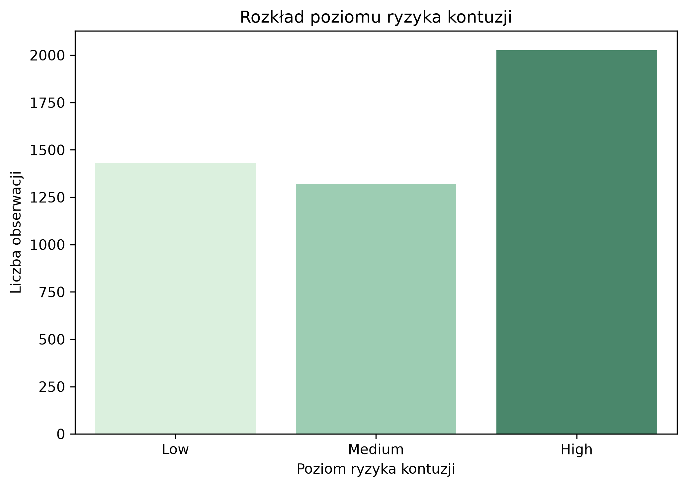
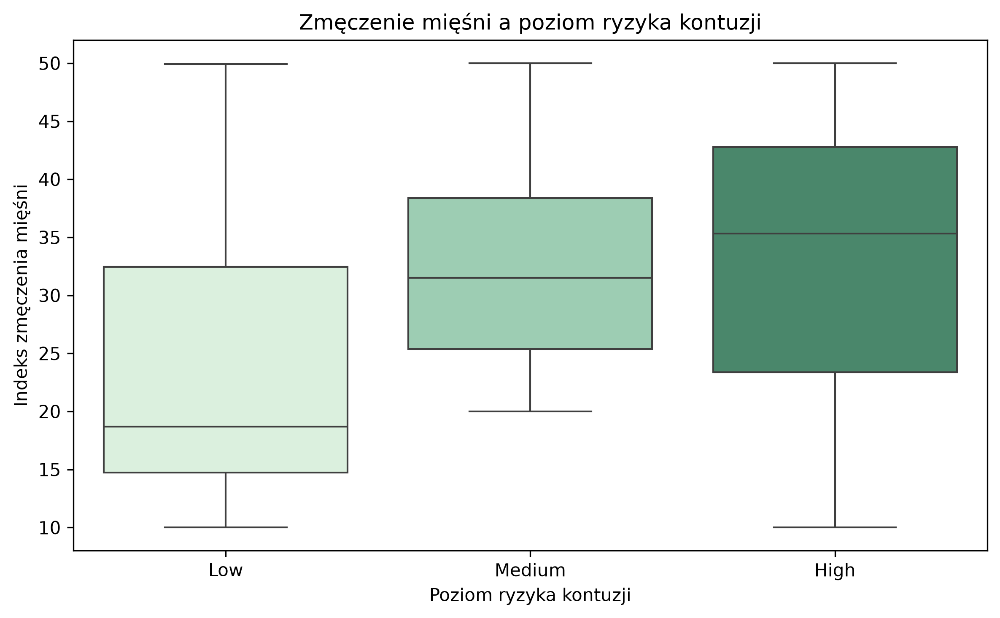
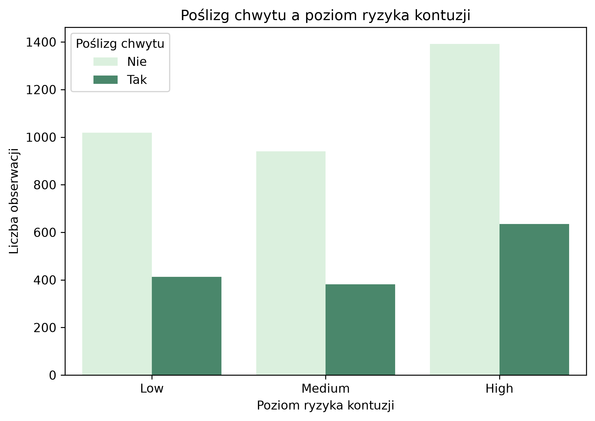
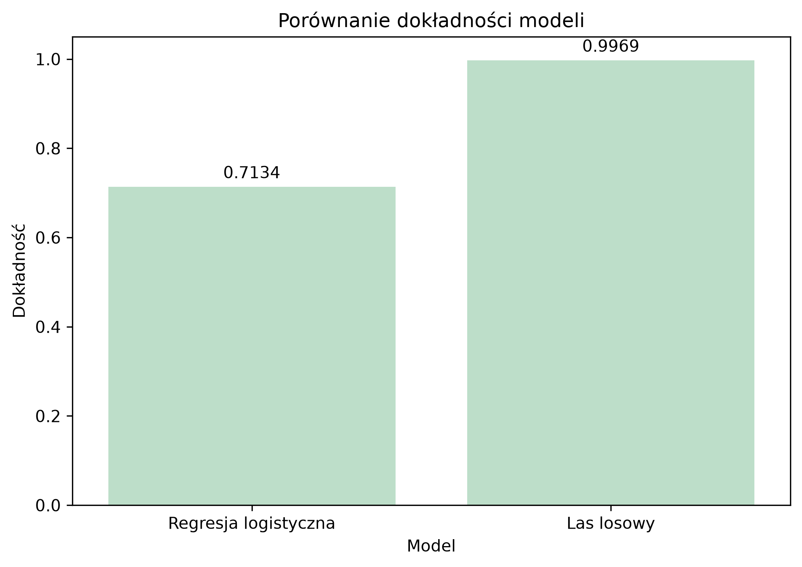
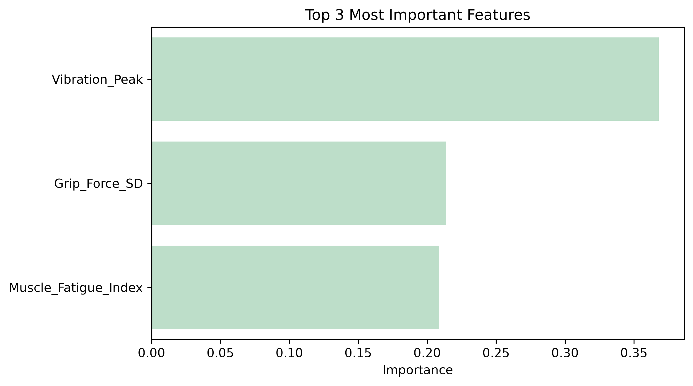

# Tennis Injury Risk Prediction

## Opis projektu

Celem projektu jest analiza danych biomechanicznych tenisistów oraz zbudowanie modelu, który przewiduje poziom ryzyka kontuzji.

W projekcie wykorzystałam dane dotyczące m.in. siły chwytu, zmęczenia mięśni, wibracji, rodzaju nawierzchni, typu uderzenia oraz poziomu ryzyka kontuzji.

Problem został potraktowany jako klasyfikacja wieloklasowa. Model przewiduje jedną z trzech klas ryzyka:

- Low
- Medium
- High

Projekt został wykonany w Pythonie w środowisku PyCharm.

## Zbiór danych

Dane pochodzą z Kaggle: **NanoGrip Tennis Biomechanics Dataset**.

Zbiór danych  zawiera 4780 obserwacji i 28 kolumn. Po wstępnym czyszczeniu usunęłam kolumny techniczne `Subject_ID` oraz `Trial_ID`, ponieważ były to identyfikatory i nie wnosiły wartości do modelowania.

Po czyszczeniu dane zawierały:

- 4780 obserwacji
- 26 kolumn
- 0 brakujących wartości
- 0 zduplikowanych wierszy

Zmienną docelową w projekcie jest `Injury_Risk_Level`.

## Cel analizy

Główne cele projektu:

- sprawdzenie rozkładu poziomu ryzyka kontuzji,
- analiza wybranych cech biomechanicznych,
- porównanie dwóch modeli klasyfikacyjnych,
- sprawdzenie, które cechy były najważniejsze dla predykcji,
- przedstawienie wyników w prosty i czytelny sposób.

## Użyte technologie

W projekcie wykorzystałam:

- Python
- pandas
- numpy
- matplotlib
- seaborn
- scikit-learn
- joblib

## Struktura projektu

- `data/` - folder z danymi
- `images/` - folder z wykresami
- `models/` - folder z zapisanym modelem i wynikami feature importance
- `src/` - folder z plikami `.py`
- `README.md` - opis projektu
- `requirements.txt` - lista użytych bibliotek

## Etapy

### 1. Wczytanie danych

Na początku wczytałam dane z pliku CSV i sprawdziłam podstawowe informacje o zbiorze:

- liczbę wierszy i kolumn,
- typy danych,
- nazwy kolumn,
- pierwsze obserwacje.

Zbiór miał początkowo 4780 wierszy i 28 kolumn.

### 2. Czyszczenie danych

W danych nie było brakujących wartości ani zduplikowanych wierszy.

Usunęłam dwie kolumny techniczne:

- `Subject_ID`
- `Trial_ID`

Nie były one potrzebne do analizy, ponieważ pełniły funkcję identyfikatorów.

Po czyszczeniu zbiór miał 4780 wierszy i 26 kolumn.

### 3. Eksploracyjna analiza danych

Sprawdziłam rozkład poziomu ryzyka kontuzji oraz zależności między wybranymi cechami a zmienną docelową.

Rozkład klas wyglądał następująco:

- High: 2027
- Low: 1432
- Medium: 1321

Najwięcej obserwacji należało do klasy `High`, ale klasy nie były bardzo mocno niezbalansowane.

### Rozkład poziomu ryzyka kontuzji

### Muscle Fatigue Index a poziom ryzyka kontuzji

### Slip Event a poziom ryzyka kontuzji

## Modelowanie

Do predykcji poziomu ryzyka kontuzji wykorzystałam dwa modele klasyfikacyjne:

- regresję logistyczną,
- las losowy.

Dane zostały podzielone na zbiór treningowy i testowy w proporcji 80/20.

Zmienną docelową była kolumna `Injury_Risk_Level`.

Zmienne kategoryczne zostały zakodowane za pomocą `get_dummies`, a dane zostały przeskalowane przy użyciu `StandardScaler`.

## Wyniki modeli

| Model | Dokładność |
|---|---:|
| Regresja logistyczna | 0.7134 |
| Las losowy | 0.9969 |

Najlepszy wynik uzyskał model **lasu losowego** z dokładnością równą **0.9969**.

### Porównanie modeli

## Najważniejsze cechy

Po treningu modelu sprawdziłam, które cechy miały największe znaczenie dla predykcji.

Najważniejsze okazały się:

- `Vibration_Peak`
- `Grip_Force_SD`
- `Muscle_Fatigue_Index`

### Najważniejsze cechy modelu

Wynik pokazuje, że model opierał predykcję głównie na cechach związanych z wibracjami, zmiennością siły chwytu oraz zmęczeniem mięśni.

## Wnioski

Na podstawie analizy można zauważyć, że:

- poziom ryzyka kontuzji był najmocniej powiązany z wybranymi cechami biomechanicznymi,
- największe znaczenie dla modelu miały `Vibration_Peak`, `Grip_Force_SD` oraz `Muscle_Fatigue_Index`,
- las losowy osiągnął dużo lepszy wynik niż regresja logistyczna,
- bardzo wysoka dokładność może oznaczać, że zmienna docelowa jest mocno zależna od kilku cech w zbiorze danych.

